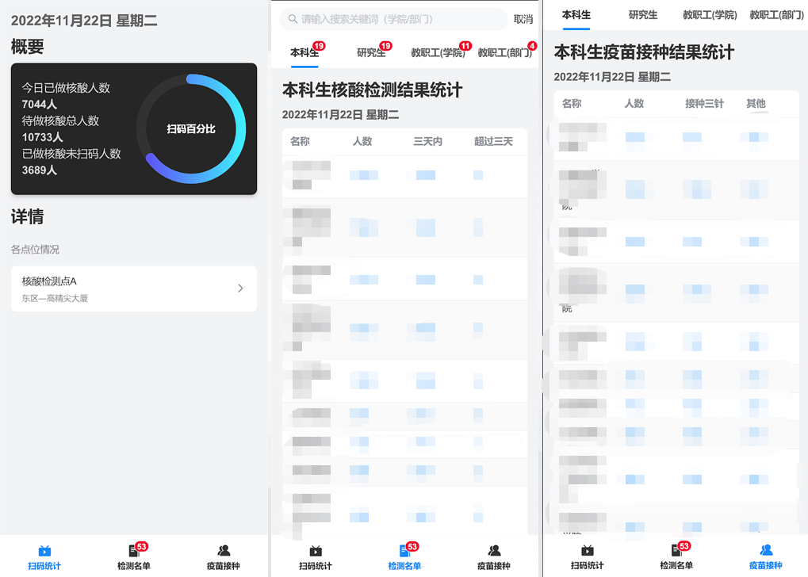

# BUCT COVID-19 Data Platform 
---
  

# Introduction
This project is designed to get the track of Beijing University of Chemical and Technology's epedemic status, includeing undergraduates, graduates and faculties. This project is deployed on WeCom workbench as mini app.
# Tech-stack
- Vue.js 3
- Vant4 UI library
- Vuex
- Vue-router
- Flask as backend support
- MySQL
# Functions
- Display the NAT(Nuclear-acid-test) data 
- Display the Vaccination data
- Support accurate search
- Display the daily NAT stat
# Installation
Once clone the repository, use `cd` command to the project directory, and then use `npm install` command to install the dependencies.
```bash
cd vue-covid-stats
npm install
```
# Screenshots

# Notice
I didn't offered the backend code of this project, so this repo can be used for Vue learning purposes.
And this project is kinda my first attempt to Web developing, so forgive the poor code quality!